# CRM(Customer relationship management) Tool

## Overview
Customer relationship management (CRM) is a technology for managing all your company’s relationships and interactions with customers and potential customers. The goal is simple: Improve business relationships. A CRM system helps companies stay connected to customers, streamline processes, and improve profitability.

## Table of Contents

- [Getting Started](#getting-started)
  - [Prerequisites](#prerequisites)
  - [Backend Setup](#backend-setup)
  - [Frontend Setup](#frontend-setup)
  - [Building](#building)
  - [Running](#running)
- [Screenshots](#screenshots)
- [Documentation](#documentation)
- [License](#license)

## Getting Started

### Prerequisites

Before you begin, ensure you have met the following requirements:

- [Visual Studio Code](https://code.visualstudio.com/download) installed.
- [Visual Studio 2022](https://visualstudio.microsoft.com/) installed.
- [.NET Core 2.2 SDK](https://dotnet.microsoft.com/en-us/download/dotnet/2.2) installed.
- [ASP.NET Runtime 2.2](https://dotnet.microsoft.com/en-us/download/dotnet/2.2) installed.
- [Visual Studio Code](https://code.visualstudio.com/) installed.
- [Node.js 12.22.12](https://nodejs.org/en/blog/release/v12.22.12) and npm (Node.js Package Manager) installed.
- [SQL Server](https://www.microsoft.com/en-in/sql-server/sql-server-downloads) installed.

### Backend Setup

1. **Create a folder to store the backend and frontend code.**
- example:  folder `ncc-erp-crm`


2. **Open a command prompt in the created folder.**


3. **Clone the repository using the following command:**

   ```bash
   git clone https://github.com/ncc-erp/ncc-erp-crm
   ```

4. **Open the backend solution using Visual Studio 2022:**

- Launch `Visual Studio 2022`.
- Select `File` > `Open` > `Project/Solution.`
- Navigate to the backend folder within created folder `ncc-erp-crm` and open the solution file.


5. **Restore NuGet packages:**

- In Solution Explorer, right-click the solution and select **Restore NuGet Packages**.


6. **Set the startup project:**

- Right-click the desired project (usually the API project) in `Solution Explorer`.
Select **Set as StartUp Project**.


7. **Get the local database file and rename it:**

- Locate the **local-project.sql** file in your local environment.
- Rename it to **local-project.sql**


8. **Update the `appsettings.json` file:**

- Open the `appsettings.json` file in the backend project.

- Locate the `ConnectionStrings` section.

- Update the **Default** connection string to match your local database information:


```json
{
  "ConnectionStrings": {
    "Default": "Server=servername; Database=local-project; User ID=yourUserId;Password=yourPassword;"
  },
  // ... other settings ...
}
```

- In the **CorsOrigins**, you add public URL of front-end:
```json
  "App": {
    "ServerRootAddress": "http://localhost:21021/",
    "ClientRootAddress": "http://localhost:4200/",
    "CorsOrigins": "http://localhost:4200,http://localhost:4202,http://localhost:8081,http://localhost:3000, more link public in FE..."
  },
```


9. **Press `F5` or select `Debug` > `Start Debugging` to run the backend.**


### Frontend Setup
1. **Open Front-end repository**
```bash
cd C:\Users\ncc-erp-crm\angular
```
- run code
```bash
code .
```

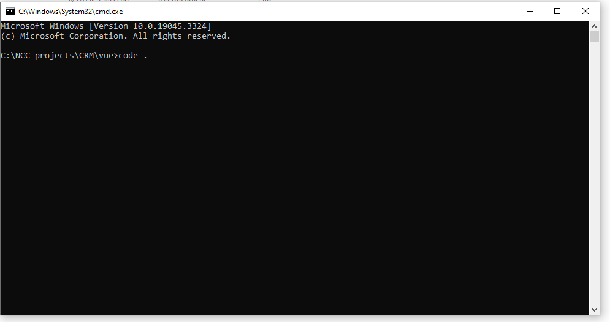

**You can also right click inside angular folder then select `Open with Code`**


2. **Install Angular CLI 9.1.15 globally:**

```bash
npm install -g @angular/cli@9.1.15
```

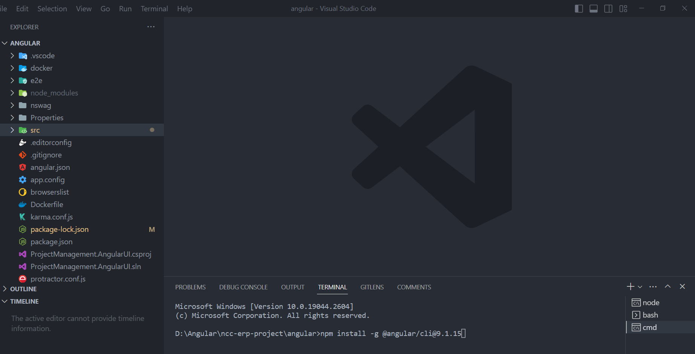


3. **Install frontend dependencies:**

```bash
npm install
```

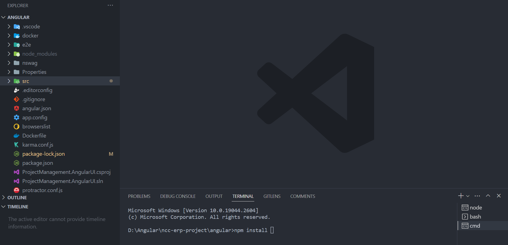

If you encounter an error while running npm install, you can use the command (recommended)
```bash 
npm install --legacy-peer-deps 
```
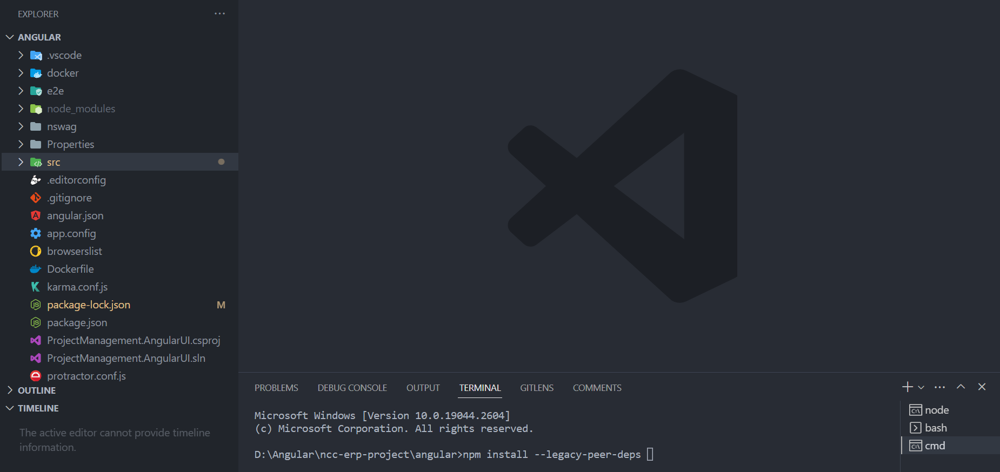

As a replacement for npm install.
The command npm install --legacy-peer-deps is used to address issues related to installing dependencies in a Node.js project when versions of the dependent packages are not compatible with each other. 


4. **Run front-end**
```bash
npm run serve
```
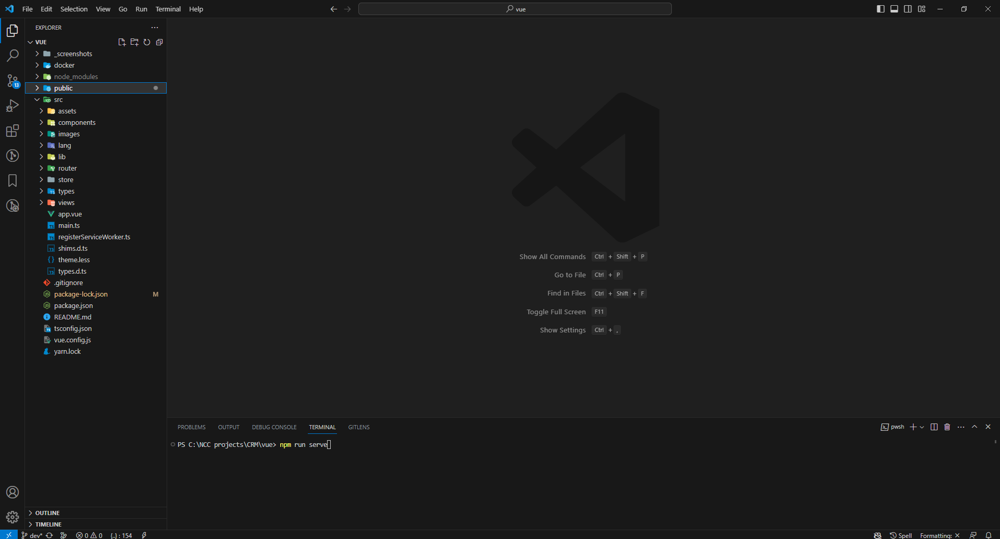

### Building
To build the project, follow these steps:

1.Build the backend using `Visual Studio Code` or the `command line`.

2.Build the frontend:

```bash
npm run build
```

### Running
To run the project, use these commands:

1. Start the backend using `Visual Studio Code` or the `command line`.

2. Start the frontend:

```bash
npm run serve
```

# Screenshots
- Login Page

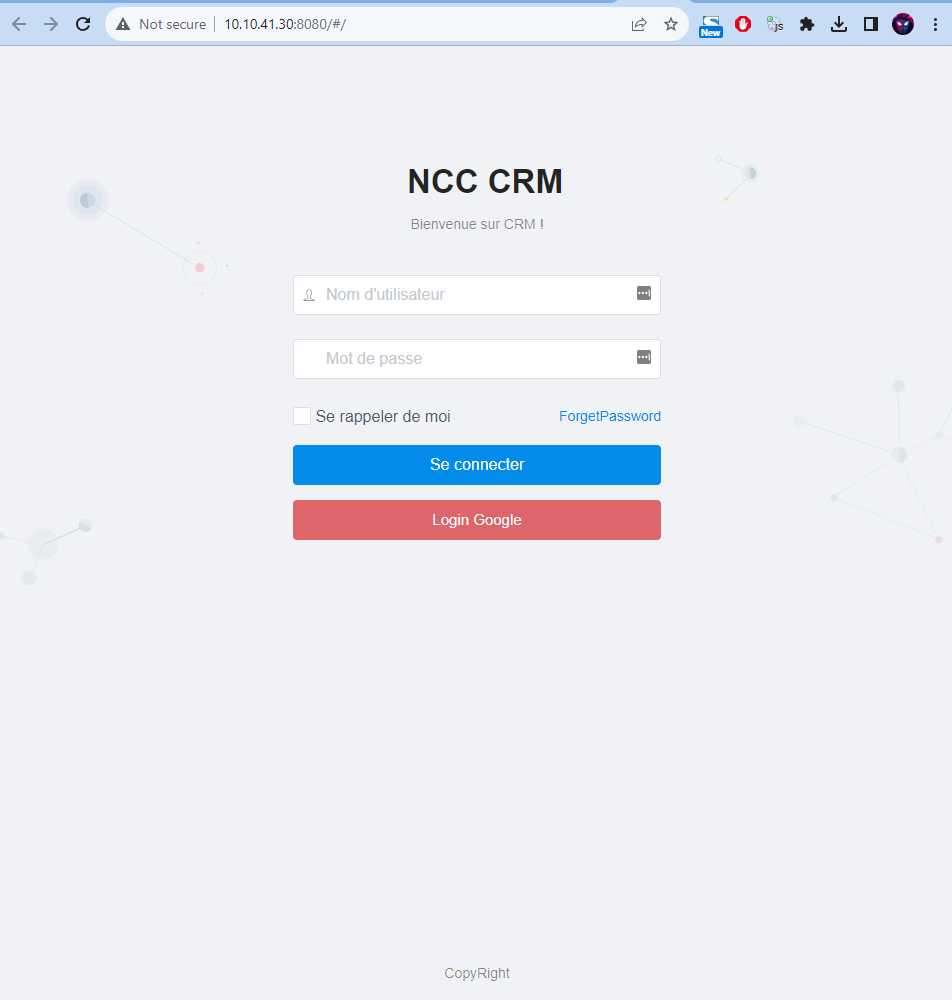

- Dashboard Page

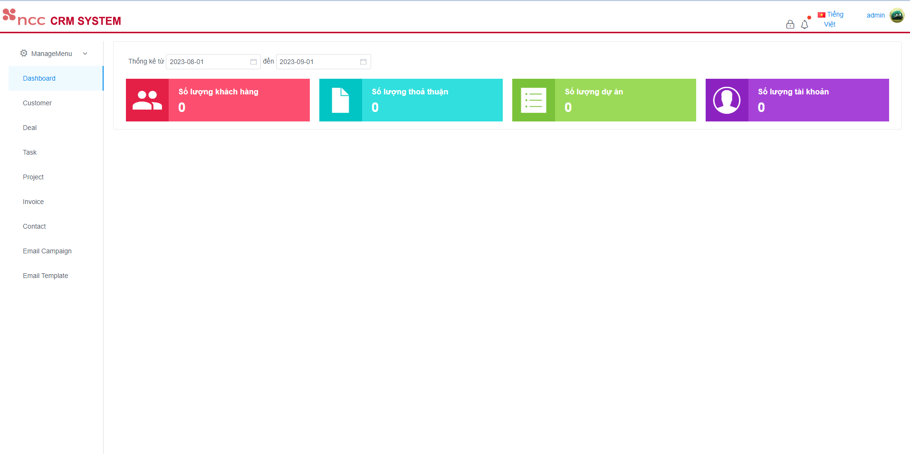

- User Management Page

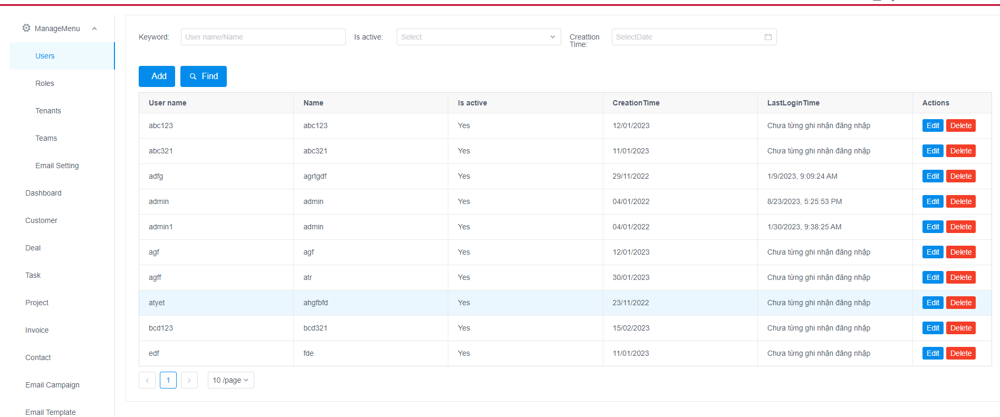

- Update user detail Modal

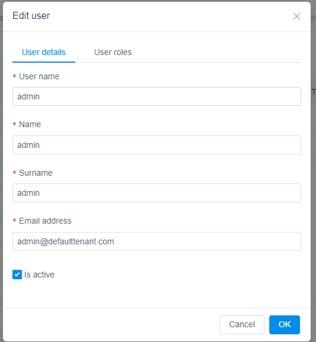

- Update Role Permission Modal

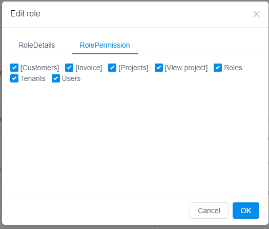

- Deal Management Page

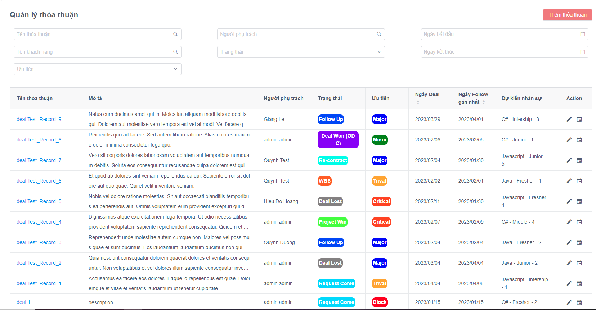

- Deal Detail Page

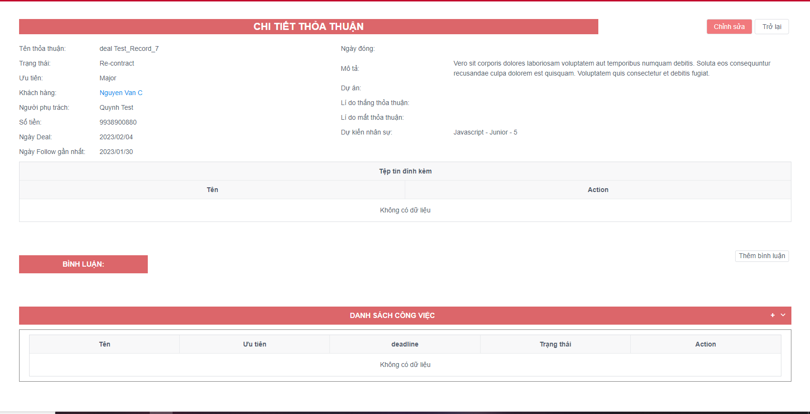

# Documentation
  - [ASP.NET Core MVC & jQuery version.](https://aspnetboilerplate.com/Pages/Documents/Zero/Startup-Template-Core)
  - [ASP.NET Boilerplate & Startup Template](https://aspnetboilerplate.com/Templates)

# License
[MIT](https://github.com/ncc-erp/ncc-erp-project/blob/dev/LICENSE)